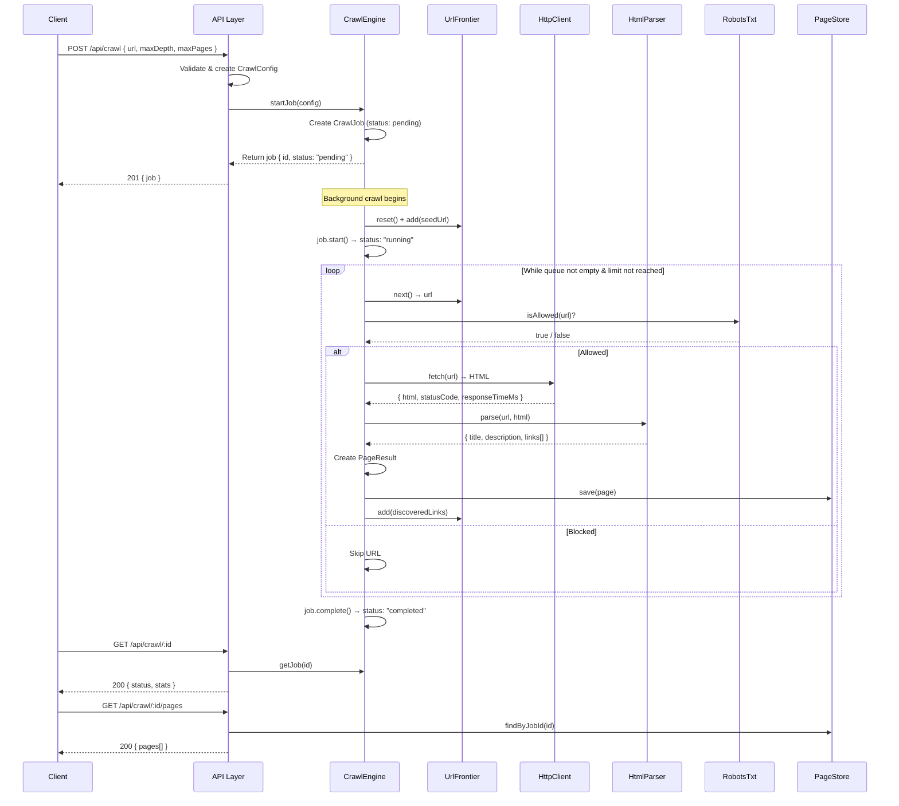
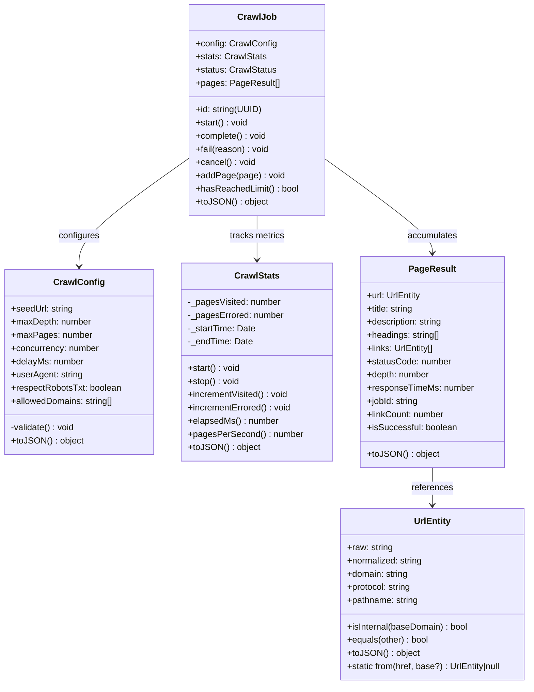
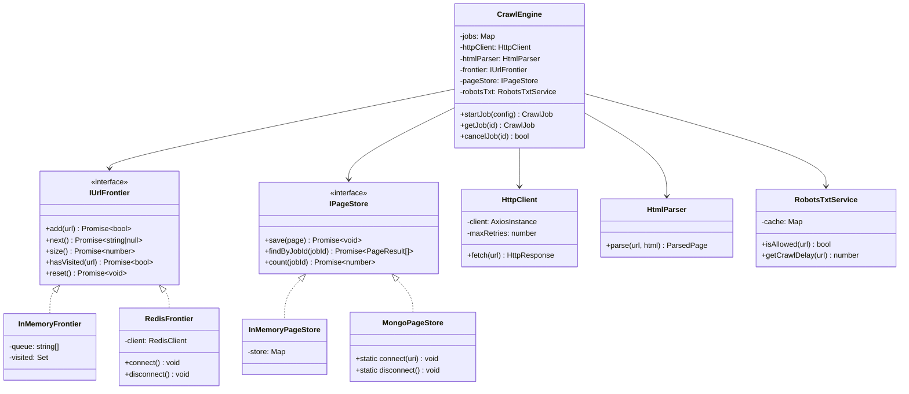
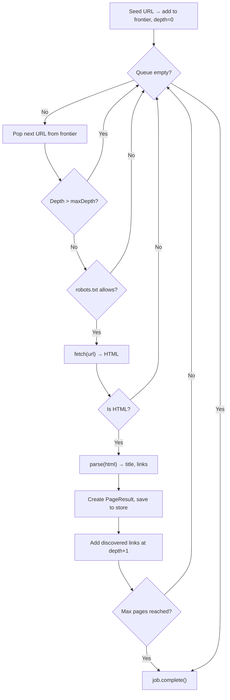
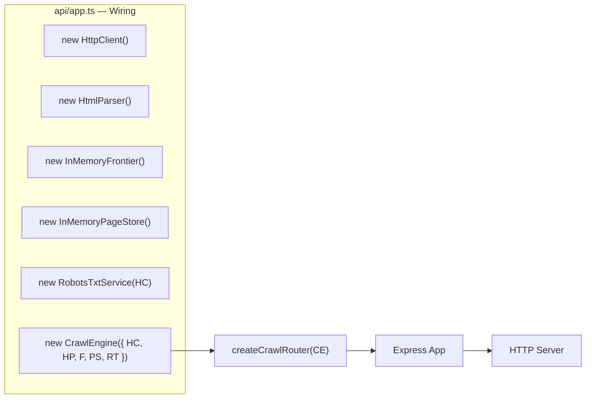

# 🕷️ Web Crawl Service

A production-grade, **OOP-based** web crawler built with **Node.js**, **TypeScript**, and **Express**. Designed with clean architecture principles — domain models, pluggable storage adapters, and a REST API for managing crawl jobs.

> **TL;DR** — Send a URL, get back structured page data (titles, descriptions, links, headings) via a BFS crawl engine with concurrency control, depth limiting, rate limiting, and robots.txt compliance.

---

## 📐 System Architecture

The project follows a **layered architecture** with clear separation of concerns. Each layer has a single responsibility and communicates only with adjacent layers through well-defined interfaces.

```
┌─────────────────────────────────────────────────────────────┐
│                      CLIENT (cURL / Postman / Frontend)     │
└─────────────────────────┬───────────────────────────────────┘
                          │ HTTP
┌─────────────────────────▼───────────────────────────────────┐
│                     API LAYER (api/)                         │
│   Express App · Routes · Middleware (Helmet, CORS, Morgan)  │
│   Endpoints: POST /api/crawl · GET /api/crawl/:id · ...    │
└─────────────────────────┬───────────────────────────────────┘
                          │ Method calls
┌─────────────────────────▼───────────────────────────────────┐
│                  CRAWLER LAYER (crawler/)                    │
│   CrawlEngine · HttpClient · HtmlParser · RobotsTxtService │
│   • BFS traversal with concurrency (p-limit)                │
│   • Depth tracking per URL                                  │
│   • Politeness delay between requests                       │
│   • robots.txt compliance                                   │
└──────────┬──────────────────────────────────┬───────────────┘
           │                                  │
           │ IUrlFrontier                     │ IPageStore
           │ interface                        │ interface
┌──────────▼──────────┐          ┌────────────▼────────────┐
│  FRONTIER (frontier/)│          │   STORAGE (storage/)    │
│  • InMemoryFrontier │          │  • InMemoryPageStore    │
│  • RedisFrontier    │          │  • MongoPageStore       │
│    (FIFO queue +    │          │    (Mongoose schema +   │
│     visited set)    │          │     CRUD operations)    │
└─────────────────────┘          └─────────────────────────┘

┌─────────────────────────────────────────────────────────────┐
│                   MODELS LAYER (models/)                     │
│   UrlEntity · CrawlConfig · CrawlJob · CrawlStats ·        │
│   PageResult                                                │
│   Pure domain objects — no I/O, no side effects             │
└─────────────────────────────────────────────────────────────┘
```

---

## 🔄 Crawl Lifecycle — How a Request Becomes Data

This diagram shows exactly what happens from the moment you send a `POST /api/crawl` request to when you retrieve the results:



---

## 🏗️ Class Diagram — Domain Models

Every piece of data in this crawler is modeled as a proper OOP class with encapsulation, validation, and serialization:



---

## 🧩 Class Diagram — Services & Interfaces

The services use **dependency injection** and **interface-driven design**. You can swap InMemory for Redis/Mongo without changing a single line in the CrawlEngine:



---

## 🌳 BFS Crawl Algorithm — Depth Tracking

The engine performs a **Breadth-First Search** starting from the seed URL. Each discovered link is assigned a depth = parent depth + 1. The crawl stops when either `maxDepth` or `maxPages` is reached:

```
Depth 0:  https://example.com/
              │
              ├──────────────────┐
Depth 1:  /about              /products
              │                   │
              ├────┐          ┌───┤
Depth 2:  /team  /blog    /shoes  /hats
                   │
              ┌────┤
Depth 3:  /post1  /post2    ← maxDepth=3 stops here
```



---

## 📂 Project Structure

```
src/
├── api/                          ← HTTP Layer
│   ├── app.ts                       Express app, middleware, route mounting
│   └── routes/
│       └── crawl.routes.ts          REST endpoints for crawl operations
│
├── crawler/                      ← Core Crawl Logic
│   ├── CrawlEngine.ts              BFS orchestrator, job management
│   ├── HttpClient.ts                Axios wrapper, retries, backoff
│   ├── HtmlParser.ts                Cheerio-based HTML parsing
│   └── RobotsTxtService.ts         robots.txt fetching & caching
│
├── frontier/                     ← URL Queue Management
│   ├── IUrlFrontier.ts              Interface contract
│   ├── InMemoryFrontier.ts          Array + Set implementation
│   └── RedisFrontier.ts             Redis List + Set implementation
│
├── storage/                      ← Page Persistence
│   ├── IPageStore.ts                Interface contract
│   ├── InMemoryPageStore.ts         Map-based implementation
│   └── MongoPageStore.ts            Mongoose/MongoDB implementation
│
├── models/                       ← Domain Models (Pure OOP)
│   ├── UrlEntity.ts                 URL normalization & validation
│   ├── CrawlConfig.ts              Job configuration value object
│   ├── CrawlJob.ts                  Job state machine (pending→running→done)
│   ├── CrawlStats.ts               Real-time metrics tracker
│   └── PageResult.ts               Crawled page data model
│
├── config/                       ← App Configuration
│   └── index.ts                     Centralized env-based config
│
├── utils/                        ← Utilities
│   └── Logger.ts                    Winston logger (singleton factory)
│
├── server.ts                     ← Entry point, graceful shutdown
└── index.d.ts                    ← Global type augmentations
```

---

## 🛣️ API Endpoints

| Method   | Endpoint                | Description                          | Request Body                                     |
| -------- | ----------------------- | ------------------------------------ | ------------------------------------------------ |
| `POST`   | `/api/crawl`            | Start a new crawl job                | `{ url, maxDepth?, maxPages?, concurrency? }`    |
| `GET`    | `/api/crawl`            | List all crawl jobs                  | —                                                |
| `GET`    | `/api/crawl/:id`        | Get job status & stats               | —                                                |
| `GET`    | `/api/crawl/:id/pages`  | Get all crawled pages for a job      | —                                                |
| `DELETE` | `/api/crawl/:id`        | Cancel a running crawl job           | —                                                |
| `GET`    | `/api/health`           | Health check                         | —                                                |

### Example — Start a Crawl

```bash
curl -X POST http://localhost:3000/api/crawl \
  -H "Content-Type: application/json" \
  -d '{"url": "http://books.toscrape.com/", "maxDepth": 2, "maxPages": 10}'
```

**Response (201):**

```json
{
  "message": "Crawl job started",
  "job": {
    "id": "a1b2c3d4-...",
    "status": "pending",
    "config": {
      "seedUrl": "http://books.toscrape.com/",
      "maxDepth": 2,
      "maxPages": 10,
      "concurrency": 5,
      "delayMs": 200
    },
    "stats": { "pagesVisited": 0, "pagesErrored": 0 }
  }
}
```

### Example — Check Job Status

```bash
curl http://localhost:3000/api/crawl/a1b2c3d4-...
```

**Response (200):**

```json
{
  "id": "a1b2c3d4-...",
  "status": "completed",
  "stats": {
    "pagesVisited": 10,
    "pagesErrored": 0,
    "elapsedMs": 4320,
    "pagesPerSecond": 2.31
  }
}
```

---

## ⚙️ How It All Connects — Dependency Injection Flow

The app wires everything together in `api/app.ts` using **constructor injection**. This makes testing trivial — just swap implementations:



**Want to switch to Redis + MongoDB?** Just change 2 lines:

```typescript
// const frontier = new InMemoryFrontier();
const frontier = new RedisFrontier('redis://localhost:6379');
await frontier.connect();

// const pageStore = new InMemoryPageStore();
const pageStore = new MongoPageStore();
await MongoPageStore.connect('mongodb://localhost:27017/webcrawl');
```

---

## 🚀 Quick Start

1. **Clone & install:**
   ```bash
   git clone <repo-url> && cd Code
   npm install
   ```

2. **Configure** — Copy `.env.example` → `.env` and set your values:
   ```env
   PORT=3000
   MONGO_URI=mongodb://localhost:27017/webcrawl
   REDIS_URL=redis://localhost:6379
   LOG_LEVEL=info
   NODE_ENV=development
   ```

3. **Run in dev mode:**
   ```bash
   npm run dev
   ```

4. **Start a crawl:**
   ```bash
   curl -X POST http://localhost:3000/api/crawl \
     -H "Content-Type: application/json" \
     -d '{"url": "http://books.toscrape.com/", "maxDepth": 1, "maxPages": 5}'
   ```

---

## 🧪 Testing

```bash
npm test            # Run all tests once
npm run test:watch  # Watch mode for development
```

---

## 🛡️ Key Design Decisions

| Decision | Rationale |
|----------|-----------|
| **In-memory defaults** | No Redis/Mongo required to run — lowers barrier to entry for development |
| **Interface-driven storage** | `IUrlFrontier` and `IPageStore` allow swapping backends without touching business logic |
| **State machine for jobs** | `CrawlJob` enforces valid transitions (pending → running → completed) preventing illegal states |
| **p-limit concurrency** | Prevents overwhelming target servers; configurable per job |
| **Politeness delay** | `delayMs` between requests — configurable, defaults to 200ms |
| **robots.txt caching** | Fetched once per domain and cached for the lifecycle of the service |
| **URL normalization** | `UrlEntity` strips fragments, trailing slashes, and lowercases host to avoid duplicate crawls |
| **Per-page error handling** | A single failed page doesn't crash the entire job |
| **Winston logger** | Structured logging with timestamps and configurable log levels |

---

## 🧰 Tech Stack

| Layer         | Technology                           |
| ------------- | ------------------------------------ |
| Runtime       | Node.js + TypeScript (ES2022)        |
| HTTP Server   | Express 5                            |
| HTML Fetching | Axios (with retries & backoff)       |
| HTML Parsing  | Cheerio                              |
| Queue (dev)   | In-memory Array + Set                |
| Queue (prod)  | Redis (List + Set)                   |
| Storage (dev) | In-memory Map                        |
| Storage (prod)| MongoDB via Mongoose                 |
| Logging       | Winston                              |
| Security      | Helmet + CORS                        |
| Testing       | Vitest                               |
| Concurrency   | p-limit                              |
| robots.txt    | robots-parser                        |

---

## 📜 License

ISC
